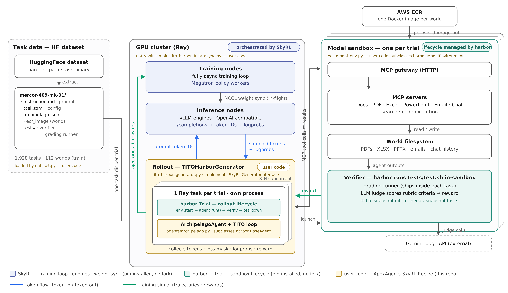

# ApexAgents-SkyRL-Recipe

A complete, public recipe for RL-training knowledge-work agents on Mercor's
APEX-Agents data, built on **open-source SkyRL** + **open-source harbor** —
import-only, zero forks. Companion code for the "Training Frontier Knowledge
Work Agents" blogpost.

## Blogpost & artifacts

- Blogpost: [Training frontier knowledge work agents: A 397B RL training guide with SkyRL](https://www.mercor.com/blog/training-frontier-knowledge-work-agents-a-397b-rl-training-guide-with-skyrl)
- Code: [Mercor-Intelligence/ApexAgents-SkyRL-Recipe](https://github.com/Mercor-Intelligence/ApexAgents-SkyRL-Recipe)
- Model checkpoints:
  - [mercor/Qwen3.6-35B-A3B-Mercor](https://huggingface.co/mercor/Qwen3.6-35B-A3B-Mercor)
  - [mercor/Qwen3.5-397B-A17B-Mercor](https://huggingface.co/mercor/Qwen3.5-397B-A17B-Mercor)
- Model eval traces:
  - Terminal-Bench 2.1: [mercor/ApexAgentsRecipe-TBench2_1-EvalTraces](https://huggingface.co/datasets/mercor/ApexAgentsRecipe-TBench2_1-EvalTraces)
  - APEX-Agents: [mercor/ApexAgentsRecipe-ApexAgents480-EvalTraces](https://huggingface.co/datasets/mercor/ApexAgentsRecipe-ApexAgents480-EvalTraces)

## Architecture



**What runs where, for one RL trial.** Training data is a HuggingFace dataset of
prebuilt harbor task directories (prompt, config, verifier); each trial consumes one
task directory (see "Data format" below). On the Ray GPU cluster, SkyRL provides the
fully-async training loop, the vLLM engines, and in-flight NCCL weight sync. Each trial
runs as its own Ray task, where harbor's `Trial` drives the rollout lifecycle
(`env start → agent.run() → verify → teardown`) around this repo's `ArchipelagoAgent`
(`agents/archipelago.py`), which exchanges raw token IDs with the engines (blue).
Every trial gets a Modal sandbox booted from its world's ECR image, exposing MCP
servers over the world's filesystem; after the agent finishes, harbor runs the
verifier in-sandbox, and the reward joins the trajectory flowing back to the trainer
(green). Box colors mark code ownership: indigo = SkyRL and teal = harbor (both
pip-installed, no forks); yellow = the code in this repo — the generator
(`tito_harbor_generator.py`, implementing SkyRL's `GeneratorInterface`), the agent,
the trial config (`harbor_trial_config/archipelago_tito.yaml`), and the entrypoints.

**Dependency pinning** (`pyproject.toml`): released versions — `harbor[modal]==0.21.0`
from PyPI; `skyrl[megatron]` 0.3.0 as an editable checkout of the release commit
(`/mnt/local_storage/oss/SkyRL-v0.3.0`, `git worktree` of NovaSky-AI/SkyRL @ `b8a5caaa`).
skyrl can't come from PyPI: uv only honors this repo's custom package sources/indexes
(Astral GPU wheels, pytorch-cu128, vllm-cu129, …) for path-dep requirements; a registry
skyrl pulls its GPU stack from PyPI sdists and fails to build. The mirrored
`[tool.uv.*]` blocks must be re-synced when bumping the skyrl pin.


## Data format

Due to license issues, we cannot open-source the data. However, the data has the following format,
which can help you understand the repo's architecture and how components piece together.

Training consumes a HuggingFace dataset repo of **prebuilt harbor tasks**
(e.g. `<HF_ORG>/apex-agents-dev-1928`): parquet shards where each row is one
task, with two columns:

| column        | contents                                              |
|---------------|-------------------------------------------------------|
| `path`        | task directory name, e.g. `mercor-409-mk-01-c87181e6` |
| `task_binary` | gzip-compressed tar archive of the task directory     |

Extracting every row yields standard harbor task directories:

```
mercor-409-mk-01-c87181e6/
├── instruction.md            # the prompt the agent sees
├── task.toml                 # harbor task config: agent/verifier timeouts,
│                             #   [verifier.env] key forwarding, resources
├── archipelago.json               # recipe-specific metadata (read by the generator)
├── environment/Dockerfile    # placeholder — real env is a prebuilt ECR image
└── tests/                    # verifier; never mounted for the agent
    ├── test.sh               # entrypoint harbor runs in-sandbox after the agent
    ├── grade.py              # drives the grading runner, emits the reward
    ├── verifiers.json        # rubric criteria (LLM-judged), hidden from agent
    ├── golden_responses.json # reference answers for the rubrics
    └── runner/               # vendored grading runner (see below)
```

`archipelago.json` fields:

```json
{
  "task_id": "task_…",
  "task_name": "409_MK_01",
  "task_slug": "409-mk-01-c87181e6",
  "world_id": "world_…",
  "world_short_name": "management-consulting-world-409",
  "ecr_image": "<AWS_ACCOUNT_ID>.dkr.ecr.<REGION>.amazonaws.com/<REPO>:<world-tag>",
  "required_env_keys": ["FMP_API_KEY"],
  "needs_snapshot": false
}
```

**Worlds vs. tasks (how ECR images work).** APEX-Agents tasks are grouped into
*worlds* — simulated companies with documents, apps, and MCP tool servers. Many
tasks share one world, and environments are built **per world, not per task**:
one Docker image per world, pushed to ECR, referenced by every task in it via
`ecr_image` (the per-task `environment/Dockerfile` is only a placeholder to
satisfy harbor's layout). At trial time `TITOHarborGenerator` reads
`archipelago.json` and passes `ecr_image` to `EcrModalEnvironment`, which routes it
through harbor's native `Image.from_aws_ecr(...)` path; Modal authenticates the
pull with the secret named by `ecr_modal_secret_name` (e.g. `aws-ecr-oidc`) in
`harbor_trial_config/archipelago_tito.yaml`.

**Grading.** `tests/runner/` is a per-task vendored copy of the grading runner
from [Mercor-Intelligence/archipelago](https://github.com/Mercor-Intelligence/archipelago),
pinned at commit `79668ba`, baked in when the dataset is built. `tests/test.sh` runs after the
agent finishes, installs the runner's deps inside the sandbox, and grades the
agent's output against `verifiers.json` with an LLM judge (`GRADING_MODEL`,
default a Gemini model via `GOOGLE_API_KEY`). The judge's per-criterion scores
become the trial reward. So at train time this repo needs **no archipelago
checkout** — the grading code ships inside every task.

**Env key plumbing.** `task.toml`'s `[verifier.env]` (and
`required_env_keys` for agent-side keys) use `${VAR}` templating resolved
from the trainer-side environment — the recipe's Ray init forwards them into
trial tasks (`HARBOR_ENV_VARS`). Tasks with `needs_snapshot: true` grade by
diffing document snapshots and additionally need `MERCOR_DOCUMENT_API` /
`MERCOR_DOCUMENT_API_KEY`.

Download + extract:

```python
# uv run python - <<'PY'
import gzip, io, tarfile
from pathlib import Path
import pyarrow.parquet as pq
from huggingface_hub import snapshot_download

repo = snapshot_download("HF-ORG/apex-agents-dev-1928", repo_type="dataset")
out = Path("/mnt/local_storage/data/harbor/apex-agents-dev-1928")
for shard in Path(repo).rglob("*.parquet"):
    t = pq.read_table(shard)
    for path, blob in zip(t["path"].to_pylist(), t["task_binary"].to_pylist()):
        with tarfile.open(fileobj=io.BytesIO(blob), mode="r:*") as tf:
            tf.extractall(out / path, filter="data")
# PY
```

`data.train_data` then points at the extracted directory (one subdir per task).

## Setup

```bash
# one-time: checkout skyrl at the 0.3.0 release commit. The path must match the
# skyrl entry in [tool.uv.sources] (and uv.lock) - if you clone elsewhere,
# update pyproject.toml accordingly and re-run `uv lock`.
git clone https://github.com/NovaSky-AI/SkyRL /mnt/local_storage/oss/SkyRL-v0.3.0
git -C /mnt/local_storage/oss/SkyRL-v0.3.0 checkout b8a5caaa
# .venv lives on big disk (repo dirs may have small quotas)
mkdir -p /mnt/local_storage/venvs/harbor-apex-recipe && ln -sfn /mnt/local_storage/venvs/harbor-apex-recipe .venv
cp <secrets>/.env.apex .   # WANDB/MODAL/HF/task-API keys; gitignored
uv sync
```

## Workflow

**1. Data** — download and extract the task dataset (see "Data format" above).

**2. Smoke test (1 GPU, validated)** — full loop: trial → TITO rollout → DPPO → ckpt
```bash
bash scripts/run_1gpu_colocated_smoke.sh &> /mnt/local_storage/recipe_smoke.log
# defaults: Qwen3.5-0.8B, 2×2 batch, 2 steps. MODEL_NAME=Qwen/Qwen3.5-9B for the 9B.
```

**3. Fully-async training (≥2 GPUs)**
```bash
# Flattened hero runs (defaults = the actual production configs; a few knobs
# not present in OSS SkyRL 0.3.0 are omitted, noted in each header):
bash scripts/run_qwen36_35b_fully_async.sh &> train.log   # 35B: 10xTP8 + 4 nodes TP8/EP8, DPPO+prompt_mean, 160k
bash scripts/run_qwen35_397b_fully_async.sh &> train.log  # 397B: 12xTP8 + 8 nodes TP4/PP4/CP2/EP16, S3 ckpts
```

**4. Eval**
```bash
bash scripts/run_eval.sh &> eval.log             # through the SkyRL eval entrypoint
```

Secrets are sourced from `.env.apex` in-script (not `uv --env-file`:
Ray's uv hook re-runs uv args inside the working_dir extract where the gitignored file
doesn't exist).


## Environment keys needed

```bash
export WANDB_API_KEY=
export HF_TOKEN=

# Modal (sandboxes)
export MODAL_TOKEN_ID=
export MODAL_TOKEN_SECRET=
export MODAL_ENVIRONMENT=

# API keys needed by some tasks (see each task's required_env_keys)
export FMP_API_KEY=
export TERRAPIN_API_KEY=

# Grading: document-parse API for needs_snapshot tasks
export MERCOR_DOCUMENT_API=
export MERCOR_DOCUMENT_API_KEY=

# LLM judge for grading
export GOOGLE_API_KEY=
```
